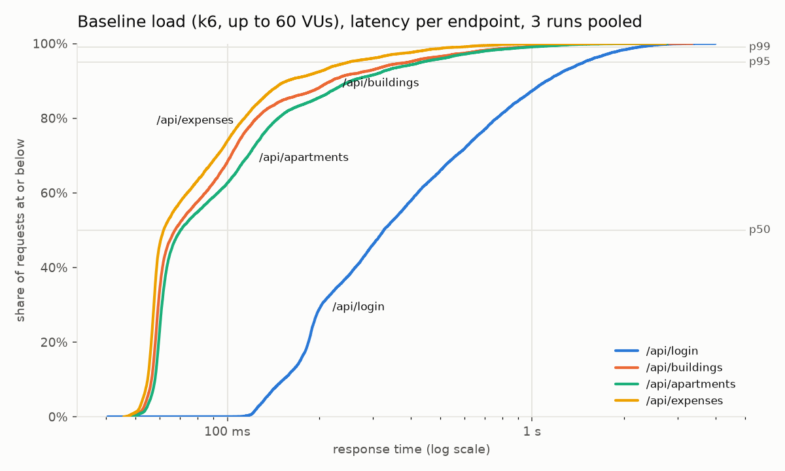
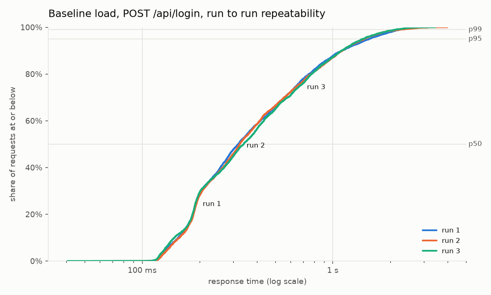
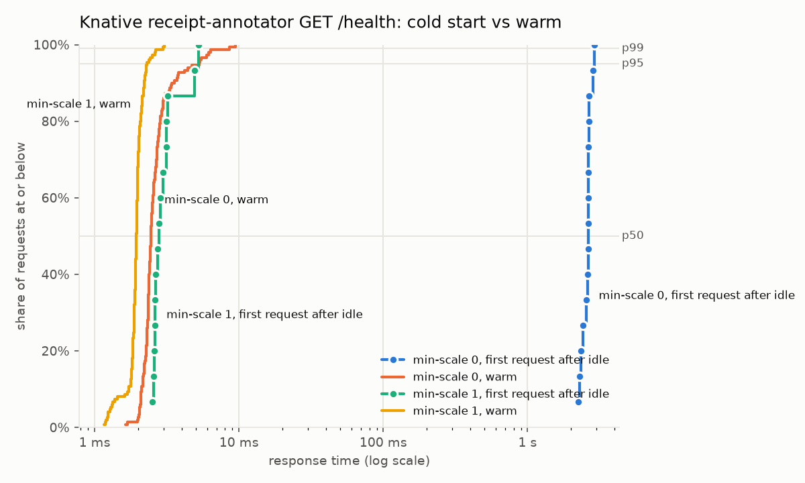

# Chapter 9: Service levels (SLIs, SLOs and SLA tiers), measured

> **Draft, 16 Sep 2026 (S9).** Numbers come from the k6 runs of 15 and 16 Sep in
> `docs/evidence/sla/`. Items marked **TODO** still need input.
> The "Notes for the team" section at the end is a working checklist and is removed
> before submission.

## 9.1 Terms

We follow the definitions of Google's Site Reliability Engineering book [1]:

- **SLI (service level indicator):** a measured quantity of service behaviour. Examples
  are request latency and the share of requests that succeed.
- **SLO (service level objective):** a target for an SLI over a window. For example,
  "95% of logins complete within 2 s".
- **SLA (service level agreement):** an agreement with users that attaches consequences
  to missing an SLO. UrbanSync has no paying customers, so what we define are SLOs grouped
  into tiers (Gold, Silver, Bronze). We call the tier table our SLA, with the consequence
  being the error budget policy in 9.6.

Two practices from [1] and [2] shape the rest of this chapter:

1. **Percentiles, not averages.** An average hides the slow tail that users actually
   notice. Every latency SLI below is a p50/p95/p99 over the full distribution, shown as a
   CDF.
2. **SLIs as a ratio of good events to valid events** [2], so availability and latency
   share one form: "good requests / all requests", where "good" means successful and, for
   latency, faster than a threshold.

## 9.2 What we measure (SLIs)

The course asks for two metrics plus scaling. We use:

| SLI | Definition | Where measured |
|---|---|---|
| **Latency** | p50, p95, p99 of `http_req_duration` per endpoint | Client side, k6, over the internet to the Azure VM |
| **Availability** | successful requests / all requests (HTTP status < 400, no transport error) | k6 `http_req_failed` |
| **Scaling** | backend replicas chosen by the HPA over time, CPU utilization vs target | `kubectl get hpa` every 15 s; Grafana "Backend replicas" panel |

The same latency is also exported server side by the backend (`http_request_duration_seconds`
histogram, Prometheus, `backend/middleware/metrics.js`) and shown on the Grafana
*UrbanSync Application* dashboard, so an operator sees the SLI live, not only in a test report.
Client-side measurement is the primary source here because it includes everything a user
waits for: network, ingress, frontend proxy and backend.

## 9.3 Method

**Environment.** Single-node Kubernetes 1.29 (kubeadm) on an Azure `Standard_B4as_v2` VM
(4 vCPU burstable, 16 GB), region Denmark East. The backend runs with requests 50m CPU /
192Mi and limits 400m / 512Mi, scaled by an HPA on CPU (target 65%, min 1, max 4).

**Baseline scenario** (`load/k6/baseline.js`, runner `load/k6/run-baseline.sh`). Each virtual
user logs in (POST `/api/login`, bcrypt, CPU-bound) and reads `/api/buildings`,
`/api/apartments` and `/api/expenses`, then sleeps 1 s. Load ramps 10 → 30 → 60 users over
6 minutes. k6 ran from a laptop (WSL2) against `http://9.205.24.56`.

**Cold-start scenario** (`load/k6/coldstart.js`, runner `load/k6/run-coldstart.sh`). One
sequential user calls the Knative `receipt-annotator` function (GET `/health`) through the
internal Kourier gateway: one request after idle, then 10 warm requests 1 s apart, then
150 s idle, five times per run. It runs once with the default `min-scale 0` (scale to zero)
and once with `min-scale 1` (one warm pod kept). k6 ran on the VM itself, because the
gateway has no external address.

**Noise control.**
- 3 repetitions per scenario, reporting the **median of the three per-run percentiles**.
- Nothing else running on the cluster.
- Before each baseline run the script waited until the HPA was back at 1 replica.
- Before each cold request the pod count was logged. All 15 min-scale 0 "first request
  after idle" samples hit **zero ready pods**, so they are true cold starts.
- The 150 s idle was measured, not guessed: with Knative defaults the pod was removed about
  110 s after the last request, so the script's original 90 s would have hit a still-draining
  pod.

**Data cleaning.** k6 under WSL2 recorded 0.6–0.7% of baseline requests with a zero
time-to-first-byte and a sub-millisecond total. That is physically impossible over the
internet, so these points are excluded and counted per run in
`docs/evidence/sla/2026-09-16-k6-percentiles.md`. The cold-start runs, with k6 on Linux
directly, had none.

## 9.4 Results

### Baseline (3 runs, median of runs)

| Endpoint | p50 | p95 | p99 |
|---|---|---|---|
| GET `/api/expenses` | 61 ms | 253 ms | 542 ms |
| GET `/api/buildings` | 69 ms | 386 ms | 898 ms |
| GET `/api/apartments` | 70 ms | 426 ms | 969 ms |
| POST `/api/login` | 325 ms | 1.47 s | 2.26 s |

- Throughput 52.4 requests/s (median), ~17,800 requests per run.
- Availability: 2 failed requests out of 53,439 (**99.996%**). Both were a single `502` on
  login about 4.5 minutes into a run (runs 1 and 2). That was during the ramp to 60 users, with
  the backend already at 4 replicas and CPU-saturated.
- The three runs are nearly identical (figure 9.2), so the median is representative.

*Figure 9.1: Baseline latency CDF per endpoint, 3 runs pooled.*

*Figure 9.2: POST /api/login, the three runs overlaid.*

**Reading figure 9.1.** The read endpoints rise steeply around 60–70 ms, so most requests
are fast and consistent. A tail up to about 1 s follows.
- **Where the tail comes from:** the slow requests are not spread over the run. In runs 1
  and 3, 361 and 384 of the read requests over 500 ms fall in minute 4 (the ramp from 30 to
  60 users). Minutes 0–2 had none, although that is when the HPA scaled out.
- **What that means:** the tail is the **capacity ceiling** (all 4 replicas, the HPA
  maximum, saturated at their CPU limit), not scaling lag.
- **Login** is a different class: bcrypt password hashing is deliberately CPU-expensive, so
  its curve sits roughly 5× to the right.

### Scaling

In every baseline run the HPA scaled the backend from 1 to 4 replicas within about 45 s of
load starting, and kept 4 for the whole run. Node CPU peaked at ~47%. It returned to
1 replica about 6 minutes after load ended (default 5-minute scale-down stabilization).
Separate curl tests with 30 and 100 parallel logins
(`docs/evidence/sla/2026-09-15-hpa-load-tests.md`) show the ceiling: about 21 logins/s at
4 replicas × 400m CPU, regardless of how many clients wait.

**TODO:** Figure 9.3, Grafana screenshot of request rate, p99 and replicas 1 → 4 during a
baseline run (not captured yet).

### Cold start (Knative, 3 runs each, median of runs)

| Configuration | Request | p50 | p95 | p99 |
|---|---|---|---|---|
| min-scale 0 | first request after idle (cold) | 2.63 s | 2.81 s | 2.84 s |
| min-scale 0 | warm | 2.5 ms | 4.3 ms | 7.4 ms |
| min-scale 1 | first request after idle | 2.6 ms | 4.6 ms | 4.8 ms |
| min-scale 1 | warm | 2.0 ms | 2.3 ms | 2.8 ms |

*Figure 9.4: receipt-annotator response time, cold vs warm, min-scale 0 and 1.*

A cold start costs about **1,000×** a warm request (2.6 s vs 2.5 ms): pod scheduling,
container start and readiness, with the Knative activator holding the request meanwhile. No
request failed; the activator buffers rather than drops.
With `min-scale 1` the same first request after 150 s idle takes 2.6 ms (p99 4.8 ms): the
penalty disappears completely. The pod log confirms one ready pod at every sample across all
three runs. The cost is one pod running permanently, 50m CPU / 128Mi requested (plus the
Knative queue-proxy sidecar), which is exactly the idle cost that scale to zero exists to
remove. So `min-scale` is the SLO lever: 0 for Bronze (cheap, a few seconds on the first
request), 1 if the function ever needs Gold-like latency.

## 9.5 SLA tiers, derived from the measurements

Following [2], each target is set from measured data with headroom above the **worst of the
three runs**, not the median, so a normal run does not breach it. It applies to the tested
load profile: up to 60 concurrent users, about 50 requests/s.

| Tier | Scope | Availability SLO | Latency SLO | Measured (worst run) |
|---|---|---|---|---|
| **Gold** | Interactive reads: `/api/buildings`, `/api/apartments`, `/api/expenses` | ≥ 99.9% | p95 ≤ 500 ms, p99 ≤ 1.5 s | p95 457 ms, p99 1.07 s |
| **Silver** | Authentication: `/api/login` | ≥ 99.9% | p95 ≤ 2 s, p99 ≤ 3 s | p95 1.56 s, p99 2.26 s |
| **Bronze** | Serverless function (receipt-annotator), scale to zero | ≥ 99% | first request after idle p99 ≤ 5 s; warm p99 ≤ 50 ms | cold p99 2.90 s; warm p99 7.4 ms |

Why this grouping:
- **Gold** holds the requests users make most often and expect to be instant.
- **Login** is slower by design (bcrypt), happens once per session and tolerates a longer
  wait.
- **Bronze** trades a few seconds of cold start for zero idle cost. Receipt processing is
  asynchronous from the user's point of view, and `min-scale 1` is the lever if that trade
  ever stops being acceptable.

**Not covered:** the full receipt extraction through Gemini (20–45 s per receipt, measured
by the team on 3 Sep) depends on an external API, so it is outside our SLOs and handled with
a timeout and circuit breaker instead.

## 9.6 Error budget and what happens on a miss

A 99.9% availability SLO allows 1 failed request per 1,000, which is 17 failures in a
17,800-request baseline run. The measured runs used at most 1.
The latency SLOs are ratios too: at most 5% of Gold requests may exceed 500 ms.

Policy we would apply (after [2]):
- While the budget is intact, deploys continue.
- If a load test or the live p99 panel shows a tier breached, feature deploys stop until the
  cause is fixed. The likely levers, in order:
  1. Raise HPA `maxReplicas`. The node had CPU to spare at 4 replicas.
  2. Raise the backend CPU limit.
  3. Scale the VM.
- The k6 thresholds in `load/k6/*.js` encode the SLOs [3], so a breach turns a test run red.

## 9.7 Planned values vs measured

The load scripts were written in August with planning thresholds before any measurement.

| Planned (August, `load/k6/*.js`) | Measured | Verdict |
|---|---|---|
| Gold = login, p95 < 300 ms | login p95 1.47 s | **Missed.** bcrypt under load was underestimated, so login moved to Silver |
| Silver = CRUD reads, p95 < 800 ms | reads p95 253–426 ms | Met with margin, so reads moved up to Gold |
| Failure rate < 0.1% | 0.004% | Met |
| Knative warm p95 < 1 s | 4.3 ms | Met |
| Knative cold p95 < 30 s | 2.81 s | Met, 10× under |

**TODO:** add the expected values from the June design document (Τεύχος v1), if it states
any, as a third column. That document is not in the repository.

## 9.8 Limitations

- **Single node.** No redundancy, so availability numbers say nothing about node failure.
- **Burstable VM.** It guarantees 40% of 4 vCPU sustained; the 6-minute runs stayed within
  its CPU credits, but longer runs could be throttled.
- **Load generator location.** Baseline k6 ran on a laptop over home internet, so latency
  includes that path. Cold-start k6 ran on the VM itself.
- **Cold start measured on `/health`,** which isolates the platform cost (pod start) from
  the function's own work.
- **HPA on CPU only.** Scaling on request rate would need `prometheus-adapter`, which is out
  of scope.

## References

1. Beyer et al., *Site Reliability Engineering*, ch. 4 "Service Level Objectives", Google, https://sre.google/sre-book/service-level-objectives/
2. Beyer et al., *The Site Reliability Workbook*, ch. 2 "Implementing SLOs", Google, https://sre.google/workbook/implementing-slos/
3. Grafana Labs, k6 documentation, "Thresholds", https://grafana.com/docs/k6/latest/using-k6/thresholds/
4. Knative documentation, "Configuring scale bounds", https://knative.dev/docs/serving/autoscaling/scale-bounds/

---

## Notes for the team (remove before submission)

**How an SLA is set up (short version of [1], [2]):**
1. Pick what users care about (latency, availability) and define each as good events / valid
   events.
2. Choose where to measure: client side (k6) for the report, server side (Prometheus) for
   live monitoring.
3. Measure first, then set targets with headroom above observed performance. Never target
   100%.
4. Write the targets as tiers with an error budget and a policy for what happens on a miss.
5. Encode the targets where they are checked automatically (k6 thresholds, Grafana panels).

**What is still needed for this chapter:**
- [x] min-scale 1 numbers and the cold-start conclusion (measured 16 Sep)
- [ ] Grafana screenshot of scale-out during a baseline run (Stefanos)
- [ ] June design document's expected values, if any (Τεύχος v1)
- [ ] Decide the report language (this draft is English; the roadmap is Greek)
- [ ] Update the k6 thresholds in `baseline.js` to the tier table above, so a re-run passes
      or fails against the real SLOs. That is a small script change, to be agreed with the team
      before the code freeze on 18 Sep.
- [ ] Antonis reviews (roadmap: SLAs owner Stefanos, reviewer Antonis)
